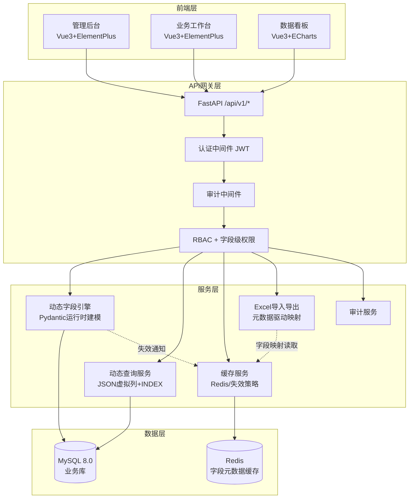
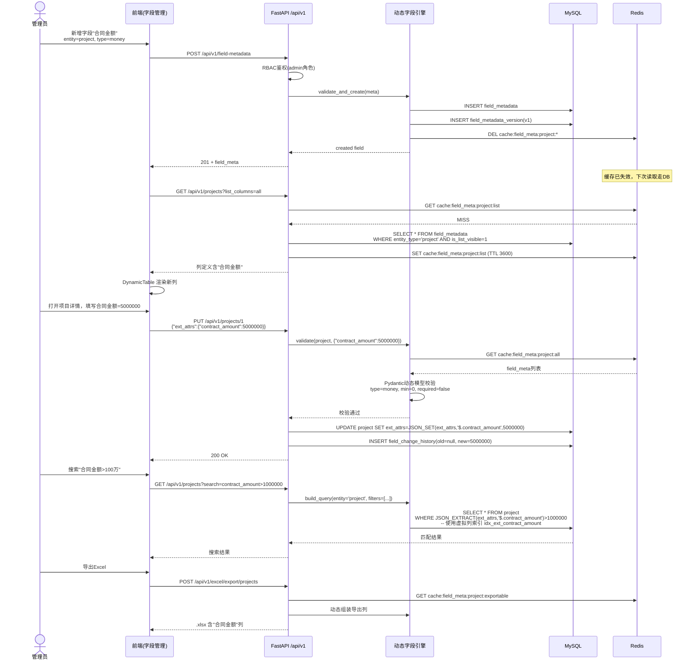

# SSM 项目基石数据平台 — 架构设计文档

## 1. 总体架构图

## 2. 领域模型 ER 图

```mermaid
erDiagram
    PROJECT ||--o{ PROJECT_MEMBER : has
    PROJECT ||--o{ FIELD_CHANGE_HISTORY : tracked_by
    PROJECT {
        bigint id PK "主键"
        varchar code UK "项目编码"
        varchar name "项目名称"
        varchar description "项目描述"
        varchar status "项目状态"
        bigint manager_id FK "负责人快照"
        json ext_attrs "动态字段JSON"
        datetime created_at
        datetime updated_at
        tinyint is_deleted
    }

    PERSON ||--o{ PROJECT_MEMBER : participates
    PERSON {
        bigint id PK
        varchar code UK "人员编码"
        varchar name "姓名"
        varchar email "邮箱"
        varchar phone "电话"
        bigint department_id FK "部门"
        varchar status "在职状态"
        json ext_attrs "动态字段JSON"
        datetime created_at
        datetime updated_at
        tinyint is_deleted
    }

    PROJECT_MEMBER {
        bigint id PK
        bigint project_id FK
        bigint person_id FK
        varchar role "角色"
        varchar responsibility "职责"
        datetime joined_at "加入时间"
        datetime left_at "退出时间"
        tinyint is_active "是否在职"
        json ext_attrs "动态字段JSON"
        datetime created_at
        datetime updated_at
        tinyint is_deleted
    }

    FIELD_METADATA ||--o{ FIELD_METADATA_VERSION : versions
    FIELD_METADATA {
        bigint id PK
        varchar entity_type "所属实体"
        varchar field_key UK "字段标识"
        varchar display_name "显示名"
        varchar data_type "数据类型"
        varchar option_set_code FK "选项集编码"
        json validation_rules "校验规则"
        int sort_order "排序"
        varchar group_name "分组"
        tinyint is_required "是否必填"
        tinyint is_list_visible "列表展示"
        tinyint is_searchable "可搜索"
        tinyint is_filterable "可筛选"
        tinyint is_exportable "可导出"
        json field_permissions "字段级权限"
        varchar status "启用/禁用"
        datetime created_at
        datetime updated_at
        tinyint is_deleted
    }

    FIELD_METADATA_VERSION {
        bigint id PK
        bigint field_meta_id FK
        int version "版本号"
        json snapshot "快照"
        varchar change_type "变更类型"
        bigint changed_by FK
        datetime changed_at
    }

    OPTION_SET ||--o{ OPTION_ITEM : contains
    OPTION_SET {
        bigint id PK
        varchar code UK "选项集编码"
        varchar name "名称"
        datetime created_at
        datetime updated_at
        tinyint is_deleted
    }

    OPTION_ITEM {
        bigint id PK
        bigint option_set_id FK
        varchar value "选项值"
        varchar label "显示标签"
        int sort_order "排序"
        varchar color "颜色标记"
        datetime created_at
        datetime updated_at
        tinyint is_deleted
    }

    SYS_USER ||--o{ SYS_USER_ROLE : has
    SYS_USER ||--o{ AUDIT_LOG : generates
    SYS_USER ||--o{ FIELD_CHANGE_HISTORY : changes
    SYS_USER {
        bigint id PK
        varchar username UK
        varchar password_hash
        varchar display_name
        varchar email
        bigint department_id FK
        tinyint is_active
        datetime created_at
        datetime updated_at
        tinyint is_deleted
    }

    SYS_ROLE ||--o{ SYS_USER_ROLE : assigned_to
    SYS_ROLE ||--o{ SYS_ROLE_PERMISSION : grants
    SYS_ROLE {
        bigint id PK
        varchar code UK "角色编码"
        varchar name "角色名"
        datetime created_at
        datetime updated_at
        tinyint is_deleted
    }

    SYS_PERMISSION ||--o{ SYS_ROLE_PERMISSION : granted_via
    SYS_PERMISSION {
        bigint id PK
        varchar code UK "权限编码"
        varchar name "权限名"
        varchar resource_type "menu/button/api"
        varchar resource_value "资源标识"
        datetime created_at
        datetime updated_at
        tinyint is_deleted
    }

    SYS_USER_ROLE {
        bigint id PK
        bigint user_id FK
        bigint role_id FK
        datetime created_at
    }

    SYS_ROLE_PERMISSION {
        bigint id PK
        bigint role_id FK
        bigint permission_id FK
        datetime created_at
    }

    SYS_DEPARTMENT {
        bigint id PK
        varchar code UK
        varchar name
        bigint parent_id FK "父部门"
        varchar path "层级路径"
        datetime created_at
        datetime updated_at
        tinyint is_deleted
    }

    AUDIT_LOG {
        bigint id PK
        bigint user_id FK
        varchar action "操作类型"
        varchar resource_type "资源类型"
        bigint resource_id "资源ID"
        text detail "操作详情JSON"
        varchar ip_address
        datetime created_at
    }

    FIELD_CHANGE_HISTORY {
        bigint id PK
        bigint entity_type_id "实体实例ID"
        varchar entity_type "实体类型"
        varchar field_key "字段标识"
        text old_value "旧值"
        text new_value "新值"
        bigint changed_by FK
        datetime changed_at
    }
```

## 7. 端到端时序图：管理员新增字段

## 8. 一期开发任务拆解

| 编号 | 模块 | 任务 | 预计人天 | 依赖 |
|------|------|------|----------|------|
| T1 | 基础设施 | Docker Compose(MySQL+Redis+FastAPI)、Alembic初始化、DDL执行 | 1 | - |
| T2 | 基础模型 | BaseModel(软删除+时间戳)、Project/Person/ProjectMember ORM | 1.5 | T1 |
| T3 | RBAC | User/Role/Permission表+CRUD+JWT认证中间件 | 2 | T1 |
| T4 | 字段元数据 | FieldMetadata/OptionSet CRUD API + 缓存服务 | 2.5 | T1 |
| T5 | 动态字段引擎 | Pydantic运行时建模、ext_attrs校验、动态查询(虚拟列+索引) | 3 | T4 |
| T6 | 项目管理CRUD | 动态实体CRUD(含校验流程)、软删除 | 2 | T2,T5 |
| T7 | 人员管理CRUD | 人员主数据CRUD、人员主页API | 1.5 | T2,T5 |
| T8 | 项目成员管理 | 成员增删改、时间轨迹查询、职责变更历史 | 2 | T2,T6,T7 |
| T9 | 审计日志 | 操作审计中间件、字段变更历史记录 | 1.5 | T3 |
| T10 | Excel导入导出 | 元数据驱动字段映射、批量导入校验、导出列动态组装 | 2 | T5,T6,T7 |
| T11 | 字段级权限 | FieldPermissions中间件、敏感字段脱敏/隐藏 | 1.5 | T3,T4 |
| T12 | 前端-管理后台 | 字段管理/选项集/角色权限页面 | 3 | T4,T3 |
| T13 | 前端-业务工作台 | 动态表格+项目360°详情+人员主页 | 4 | T6,T7,T8,T10 |
| T14 | 前端-动态组件 | DynamicForm/DynamicTable 通用组件 | 3 | T5,T12 |

**一期总工期：约 30 人天（前后端并行开发可压缩到 2~3 周）**
